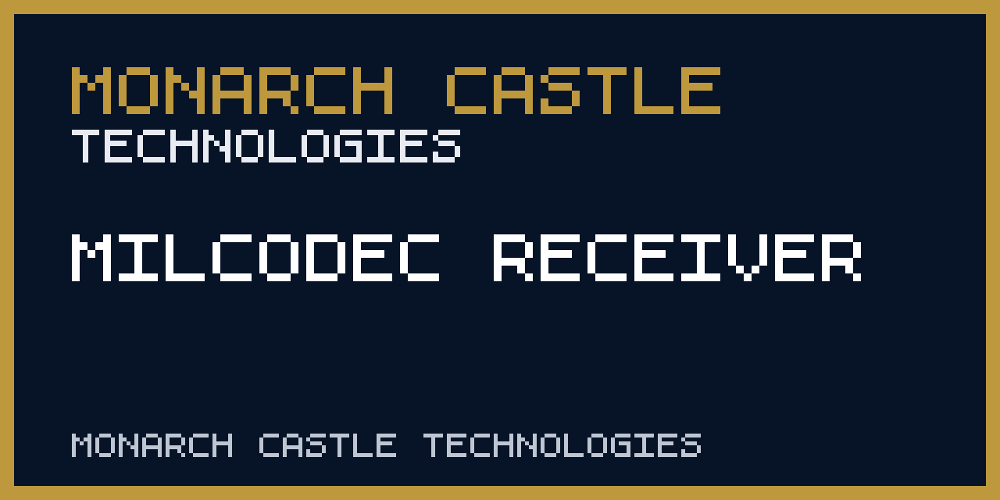

<div align="center">
  <picture><source media="(prefers-color-scheme: dark)" srcset="https://raw.githubusercontent.com/monarchcastletech/milcodec-receiver/main/docs/logo-dark.png"></picture>
  <!-- CODEX: generate a clean product logo — a stylized hexagonal "⬡" signal/receiver glyph with a chirp waveform sweeping across it, in cyan (#00d4ff) and signal-green (#00ff88) on a near-black (#0d0d14) field. Defense-grade, minimal, monogram-friendly. -->

  # Milcodec Receiver
  ### Browser-based acoustic data link for MILCODEC encrypted signals

  
  
  
  
</div>

> **Executive summary** — MILCODEC Receiver is a zero-install browser demonstration that detects the repository's chirp-spread-spectrum packet format, checks a shared-key packet envelope, and displays decoded text locally. It is intended for codec development, interoperability experiments, and browser audio testing.

> **Technical demonstration utility. Not authenticated operational intelligence.**
>
> Shared demo key verifies packet integrity only; it does not authenticate sender identity.

## ✨ Highlights
- **Data-over-sound** reception in the **14–17 kHz** near-ultrasonic band — no radios, no pairing, no network. The air gap *is* the channel.
- **Chirp Spread Spectrum ("The Dolphin") modulation** — binary chirp keying (up-chirp = 1, down-chirp = 0) at 20 baud, decoded with a matched-filter correlation receiver for robustness against ambient noise.
- **Shared-key packet integrity** via TweetNaCl `secretbox` (XSalsa20-Poly1305), with no claim of sender identity.
- **Forward error correction** — 3× repetition coding with majority-vote bit recovery, plus a preamble + 16-bit sync word + length-prefixed framing protocol for reliable packet recovery.
- **Military message precedence** — decoded traffic is tagged `FLASH` / `IMMEDIATE` / `ROUTINE`, with audible alerting on high-priority receipt.
- **Direct, accessible receiver UI** with keyboard-operable controls, inline permission errors, a live spectrum, and a decoded-message inbox.
- **Real-time spectral visualizer** — Web Audio FFT spectrum and signal-strength indicator for live link assessment.

## 🖼️ Preview
<!-- CODEX: capture real screenshots from the live build at https://monarchcastletech.github.io/milcodec-receiver/ and drop them into docs/ -->
<!--  (screenshot pending) -->
<!--  (screenshot pending) -->

## 🧭 What it does
MILCODEC Receiver is the receive-side demonstration for this repository's acoustic packet format. A compatible test sender can play an encoded waveform through a speaker; this page listens through the microphone, recovers a candidate bitstream, opens its shared-key envelope, and displays valid text.

**End-to-end signal flow:**
```
PC Sender → Speaker → Air (acoustic) → Device Mic → Milcodec Receiver → Decode → Decrypt → Inbox
```

### Demodulation — "The Dolphin" CSS engine (`decoder.js`)
The decoder generates linear up- and down-chirp templates (14 kHz ⇄ 17 kHz over a 50 ms symbol) and slides them across the captured audio as a correlation receiver. It locates the `U-U-D-D` preamble by spaced peak detection, locks to a 16-bit sync word, reads a 16-bit payload-length field, then recovers each payload bit by majority vote across three transmitted copies before reassembling bytes.

### Decryption & authentication (`crypto.js`)
Recovered payloads are NaCl `secretbox` frames (24-byte nonce + ciphertext). On successful open, the inner packet is parsed as `1-byte type + 64-byte signature field + JSON body`, yielding the message text and its precedence. Failed opens are rejected and never displayed.

### Operator console (`index.html`, `app.js`, `style.css`)
The console runs entirely on the Web Audio API — `getUserMedia` capture, an `AnalyserNode` spectrum, and a bounded local buffer passed to the decoder. The page requests microphone access only when the start button is activated. It exposes receiver status, decoded messages, and a local diagnostic log without a hidden passcode flow.

## 🗂️ Inputs, outputs & provenance
This is an analytical **tool**, not a data feed — but Monarch Castle doctrine still governs every message it surfaces: *evidence before assertion.*

- **Input:** live acoustic audio from the device microphone (mono, 44.1 kHz), captured only after explicit user permission.
- **Output:** decoded messages, each stamped at the point of receipt with:
  - **collected_at** — local reception timestamp on the receiving device,
  - **priority** — military precedence (`FLASH` / `IMMEDIATE` / `ROUTINE`),
  - **method** — `MILCODEC CSS · 14–17 kHz · secretbox(XSalsa20-Poly1305)`,
  - **verification** — authentication status of the sender / packet.
- **Auditability:** a live debug log records preamble locks, extracted bit counts, payload lengths, and decrypt outcomes so every displayed message is traceable from raw audio to plaintext.

## 🛠️ Tech stack
- **Language:** vanilla **JavaScript** (no framework, no build step) · **HTML5** · **CSS3**
- **DSP / capture:** **Web Audio API** — `AudioContext`, `AnalyserNode`, `ScriptProcessorNode`, `getUserMedia`; HTML5 `<canvas>` spectrum rendering
- **Cryptography:** **TweetNaCl** (`nacl-fast`) + `tweetnacl-util`, loaded via jsDelivr CDN
- **Modulation:** custom Chirp Spread Spectrum codec ("The Dolphin") with repetition-code FEC
- **Hosting:** **GitHub Pages** (static, HTTPS — required for microphone access); `.nojekyll` for raw asset serving
- **Test harnesses:** `test_crypto.html`, `test_file.html` — in-browser round-trip checks for the crypto and end-to-end paths

## 🚀 Getting started

**Use the live build (recommended):**
- Open **https://monarchcastletech.github.io/milcodec-receiver/** on a modern browser (Chrome, Safari, or Firefox) — HTTPS is required for microphone access.

**Operate the receiver:**
1. The interface opens as an FM radio tuner (cover mode).
2. Select **Run local packet demo** to verify encryption, integrity checking, parsing, and inbox delivery without microphone permission.
3. For acoustic reception, activate **Start microphone receiver** and grant microphone permission.
4. Play a compatible MILCODEC test waveform near the device microphone.
5. Decoded transmissions appear in the **Message inbox**, tagged by precedence.

**Run locally:**
```bash
git clone https://github.com/monarchcastletech/milcodec-receiver.git
cd milcodec-receiver
python -m http.server 8080
# open http://localhost:8080
```

**Deployment:** Legacy GitHub Pages is deliberately preserved from `main` at the repository root. No Actions workflow has replaced it because an identical-artifact migration has not been proven.

> **Security boundary.** This build ships with a hardcoded shared demo key. It does not provide key exchange, participant identity, replay prevention, traffic analysis resistance, or a trusted operational workflow. Audio buffers are capped at 30 seconds and decoded packets at 1,024 bytes; message text is inserted through `textContent`.

## 🧱 Part of Monarch Castle
> A product of **Defense Intelligence** · **Monarch Castle Technologies** — an operating company of **[Monarch Castle Holdings](https://github.com/MonarchCastleHoldings)**.
> Sister companies: [Monarch Castle Technologies](https://github.com/monarchcastletech) · [Strategic Data Company of Ankara](https://github.com/SDCofA)

## 📜 License
See `LICENSE`. © 2026 Monarch Castle Holdings · Ankara, Türkiye.

<div align="center"><sub>Part of Monarch Castle Technologies.</sub></div>

---

<!-- repository-hygiene:start -->


Browser-based acoustic data link that demodulates and decrypts MILCODEC chirp-spread-spectrum signals over sound — a Monarch Castle Technologies / Defense Intelligence receiver.


## Repository status

Lifecycle: **Active**. The badge and this statement describe maintenance status, not service availability.

## Public access

[Open the published project](https://monarchcastletech.github.io/milcodec-receiver/)

## Screenshots



The preview is maintained as a repository asset; the live interface or generated output remains authoritative.

## Data and methodology

- [decoder.js](decoder.js)
- [crypto.js](crypto.js)

These repository-specific sources define the methodology or provenance boundary. Source dates, transformation steps, and known gaps must travel with analytical outputs.

## Update frequency

Release-driven; the receiver has no background data feed.

## Quick start

```shell
python -m http.server 8080
```

Run only in a trusted development environment and review repository-specific prerequisites before using networked or hardware features.

## Architecture

- `decoder.js` — repository-specific implementation, data, or configuration boundary.
- `crypto.js` — repository-specific implementation, data, or configuration boundary.
- `app.js` — repository-specific implementation, data, or configuration boundary.

## Tests

```shell
node --test tests/repository-hygiene.test.mjs
```

## Provenance

Original software history is maintained in Git. External datasets, reports, trademarks, screenshots, and assets are not relicensed by this repository; see [THIRD_PARTY_NOTICES.md](THIRD_PARTY_NOTICES.md) before reuse.

## Forecast limitations

This repository does not publish a guaranteed forecast. Any scenarios, scores, or forward-looking language are analytical aids, not facts or advice; review source dates and methodology before use.

## Security

Do not publish vulnerabilities in an issue. Use GitHub's private vulnerability-reporting flow when available, or follow the [organization security policy](https://github.com/MonarchCastleTech/.github/security/policy).

## License

Original repository code and documentation are available under **MIT**; see [LICENSE](LICENSE). That license does not override third-party terms documented in [THIRD_PARTY_NOTICES.md](THIRD_PARTY_NOTICES.md).

## Citation

Use the machine-readable [CITATION.cff](CITATION.cff). Cite the specific commit and, for analytical use, record the data or model snapshot date.

## Masterbrand endorsement

MILCODEC Receiver is a Monarch Castle Technologies project. **Part of Monarch Castle Technologies.**

<!-- repository-hygiene:end -->
